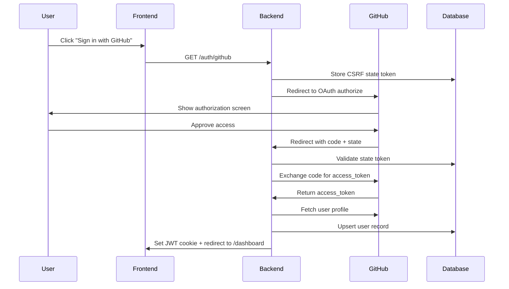

Nectr uses GitHub OAuth to authenticate users and access their repositories. This guide walks you through creating and configuring a GitHub OAuth App.

## Overview

GitHub OAuth enables:
- **User Authentication** - Users sign in with their GitHub account
- **Repository Access** - Nectr can read PR data and post review comments
- **Organization Access** - Users can grant access to organization repositories

**OAuth Scopes Required:**
- `repo` - Full control of private repositories
- `read:user` - Read user profile data
- `user:email` - Access user email addresses
- `read:org` - Read organization membership

---

## Creating a GitHub OAuth App

<Steps>
  <Step title="Navigate to GitHub Developer Settings">
    Go to [github.com/settings/developers](https://github.com/settings/developers) and click **New OAuth App**.
    
    Or navigate manually:
    1. GitHub → Settings
    2. Developer settings (bottom of sidebar)
    3. OAuth Apps → New OAuth App
  </Step>
  
  <Step title="Configure OAuth App Details">
    Fill in the application details:
    
    | Field | Value |
    |-------|-------|
    | **Application name** | `Nectr AI PR Review` (or your preferred name) |
    | **Homepage URL** | Your frontend URL (e.g., `https://your-app.vercel.app`) |
    | **Application description** | Optional: "AI-powered pull request review agent" |
    | **Authorization callback URL** | `https://your-backend.up.railway.app/auth/github/callback` |
    
    <Warning>
      The **Authorization callback URL** must point to your **backend** API, not your frontend.
      
      Format: `{BACKEND_URL}/auth/github/callback`
      
      Examples:
      - Development: `http://localhost:8000/auth/github/callback`
      - Production: `https://your-backend.up.railway.app/auth/github/callback`
    </Warning>
  </Step>
  
  <Step title="Save Client ID and Secret">
    After creating the app, GitHub will display:
    
    - **Client ID** - A public identifier (e.g., `Iv1.abc123...`)
    - **Client Secret** - A secret key (click "Generate a new client secret")
    
    Copy both values to your `.env` file:
    
    ```bash
    GITHUB_CLIENT_ID=Iv1.abc123...
    GITHUB_CLIENT_SECRET=your-client-secret
    ```
    
    <Warning>
      Store the client secret securely. You won't be able to see it again after leaving the page.
    </Warning>
  </Step>
</Steps>

---

## OAuth Flow

Nectr implements a standard OAuth 2.0 authorization code flow with CSRF protection.



### Step-by-Step Process

<Accordion title="1. User Initiates Login">
  Frontend redirects to `GET /auth/github`
  
  ```typescript
  // Frontend code
  window.location.href = `${API_URL}/auth/github`;
  ```
</Accordion>

<Accordion title="2. Backend Generates CSRF State">
  Backend generates a random state token and stores it in the database with a 10-minute expiration.
  
  ```python
  # app/auth/router.py:22-37
  state = secrets.token_urlsafe(32)
  expires_at = datetime.now(timezone.utc) + timedelta(minutes=10)
  
  oauth_state = OAuthState(state=state, expires_at=expires_at)
  db.add(oauth_state)
  await db.commit()
  ```
  
  This protects against CSRF attacks by ensuring the callback comes from a legitimate request.
</Accordion>

<Accordion title="3. Redirect to GitHub Authorization">
  Backend redirects user to GitHub's OAuth authorization page.
  
  ```python
  github_url = (
      f"https://github.com/login/oauth/authorize"
      f"?client_id={settings.GITHUB_CLIENT_ID}"
      f"&scope=repo,read:user,user:email,read:org"
      f"&state={state}"
  )
  return RedirectResponse(url=github_url)
  ```
</Accordion>

<Accordion title="4. User Grants Access">
  GitHub shows an authorization screen asking the user to grant access to:
  - Their public and private repositories
  - Their profile information
  - Organization memberships (if any)
  
  After approval, GitHub redirects to the callback URL with:
  - `code` - Temporary authorization code
  - `state` - The CSRF token we provided
</Accordion>

<Accordion title="5. Backend Validates and Exchanges Code">
  ```python
  # app/auth/router.py:48-84
  
  # 1. Validate CSRF state
  oauth_state = await db.execute(
      select(OAuthState).where(
          OAuthState.state == state,
          OAuthState.expires_at > datetime.now(timezone.utc),
      )
  )
  if not oauth_state:
      raise HTTPException(status_code=400, detail="Invalid or expired OAuth state")
  
  # 2. Exchange code for access token
  access_token = await exchange_code_for_token(code)
  
  # 3. Fetch user profile from GitHub
  gh_user = await fetch_github_user(access_token)
  ```
</Accordion>

<Accordion title="6. Store User and Set JWT Cookie">
  Backend stores/updates the user in the database with their encrypted GitHub token.
  
  ```python
  # app/auth/router.py:89-114
  user = User(
      github_id=gh_user["id"],
      github_username=gh_user["login"],
      github_access_token=encrypt_token(access_token),  # Encrypted with SECRET_KEY
      email=gh_user.get("email"),
      avatar_url=gh_user.get("avatar_url"),
      name=gh_user.get("name"),
  )
  db.add(user)
  await db.commit()
  
  # Create JWT token
  jwt_token = create_access_token(user.id)
  
  # Set httpOnly cookie and redirect to dashboard
  response = RedirectResponse(url=f"{settings.FRONTEND_URL}/dashboard")
  response.set_cookie(
      key="access_token",
      value=jwt_token,
      httponly=True,
      secure=is_production,
      samesite="none" if is_production else "lax",
      max_age=settings.ACCESS_TOKEN_EXPIRE_MINUTES * 60,
  )
  ```
  
  The GitHub access token is encrypted using Fernet (AES-128-CBC) before storage.
</Accordion>

---

## Token Security

### Encryption

GitHub OAuth tokens are encrypted before being stored in the database using the `SECRET_KEY` environment variable.

```python
# app/auth/token_encryption.py
from cryptography.fernet import Fernet

cipher = Fernet(settings.SECRET_KEY.encode())

def encrypt_token(token: str) -> str:
    return cipher.encrypt(token.encode()).decode()

def decrypt_token(encrypted_token: str) -> str:
    return cipher.decrypt(encrypted_token.encode()).decode()
```

<Warning>
  If you change `SECRET_KEY`, all existing encrypted tokens will become invalid and users will need to re-authenticate.
</Warning>

### JWT Cookies

Nectr uses JWT tokens stored in httpOnly cookies for session management:

| Property | Development | Production |
|----------|-------------|------------|
| `httponly` | `true` | `true` |
| `secure` | `false` | `true` |
| `samesite` | `lax` | `none` |
| `max_age` | 1440 minutes (24h) | 1440 minutes (24h) |

**Why httpOnly?** Prevents XSS attacks by making the cookie inaccessible to JavaScript.

**Why SameSite=none in production?** Allows cross-origin requests when frontend and backend are on different domains.

---

## Granting Organization Access

By default, users can only access their personal repositories. To access organization repositories:

<Steps>
  <Step title="User Clicks Reconnect">
    Navigate to `GET /auth/github/reconnect` endpoint.
    
    This revokes the current OAuth token and redirects to a fresh GitHub authorization screen.
    
    ```python
    # app/auth/router.py:148-188
    await revoke_github_token(access_token)
    
    # Redirect to fresh OAuth flow
    github_url = (
        f"https://github.com/login/oauth/authorize"
        f"?client_id={settings.GITHUB_CLIENT_ID}"
        f"&scope=repo,read:user,user:email,read:org"
        f"&state={new_state}"
    )
    ```
  </Step>
  
  <Step title="GitHub Shows Org Access Screen">
    GitHub displays an authorization screen with organization access requests.
    
    Users can:
    1. Grant access to specific organizations
    2. Approve access for the OAuth app
  </Step>
  
  <Step title="User Completes Fresh OAuth Flow">
    After granting access, the user completes the OAuth flow again with the new permissions.
    
    The new token will have access to the granted organization repositories.
  </Step>
</Steps>

---

## Testing OAuth Locally

### Local Development Setup

1. **Create a separate OAuth App for local development**
   
   GitHub doesn't allow `localhost` in production OAuth apps, so create a dedicated dev app:
   
   - Homepage URL: `http://localhost:3000`
   - Callback URL: `http://localhost:8000/auth/github/callback`

2. **Configure local environment**
   
   ```bash
   # .env
   GITHUB_CLIENT_ID=Iv1.your-dev-client-id
   GITHUB_CLIENT_SECRET=your-dev-client-secret
   BACKEND_URL=http://localhost:8000
   FRONTEND_URL=http://localhost:3000
   APP_ENV=development
   ```

3. **Test the flow**
   
   ```bash
   # Start backend
   uvicorn app.main:app --reload --port 8000
   
   # Visit
   http://localhost:8000/auth/github
   ```
   
   You should be redirected to GitHub, then back to your frontend dashboard after approval.

<Warning>
  Make sure your frontend is configured to include credentials in API requests:
  
  ```typescript
  // axios configuration
  const api = axios.create({
    baseURL: process.env.NEXT_PUBLIC_API_URL,
    withCredentials: true,  // Required for httpOnly cookies
  });
  ```
</Warning>

---

## Troubleshooting

<Accordion title="Redirect URI Mismatch Error">
  **Error:** `redirect_uri_mismatch`
  
  **Cause:** The callback URL in your GitHub OAuth App doesn't match the URL Nectr is using.
  
  **Solution:**
  1. Check your `BACKEND_URL` in `.env`
  2. Verify the callback URL in GitHub OAuth App settings matches: `{BACKEND_URL}/auth/github/callback`
  3. Ensure there are no trailing slashes or typos
</Accordion>

<Accordion title="Invalid OAuth State Error">
  **Error:** `Invalid or expired OAuth state`
  
  **Cause:** 
  - State token expired (>10 minutes)
  - Database connection issue
  - CSRF token mismatch
  
  **Solution:**
  1. Try the login flow again (state tokens expire after 10 minutes)
  2. Check database connectivity
  3. Ensure cookies are enabled in your browser
</Accordion>

<Accordion title="Session Expired / Token Decryption Failed">
  **Error:** `Session expired — please log out and sign in again`
  
  **Cause:** `SECRET_KEY` changed after the user authenticated.
  
  **Solution:**
  - User must log out and sign in again
  - All encrypted tokens are invalidated when `SECRET_KEY` changes
  - Avoid changing `SECRET_KEY` in production
</Accordion>

<Accordion title="Can't Access Organization Repositories">
  **Cause:** User hasn't granted organization access to the OAuth app.
  
  **Solution:**
  1. Navigate to `/auth/github/reconnect` endpoint
  2. This will revoke the current token and show a fresh GitHub authorization screen
  3. Grant access to the desired organizations
  4. Complete the OAuth flow again
</Accordion>

---

## API Endpoints

| Method | Endpoint | Description |
|--------|----------|-------------|
| `GET` | `/auth/github` | Start OAuth flow |
| `GET` | `/auth/github/callback` | OAuth callback (handles code exchange) |
| `GET` | `/auth/me` | Get current authenticated user |
| `GET` | `/auth/github/reconnect` | Revoke token and re-authorize (for org access) |
| `POST` | `/auth/logout` | Clear auth cookie |

**Source:** `app/auth/router.py:18-203`

---

## Next Steps

<CardGroup cols={2}>
  <Card title="Environment Variables" icon="gear" href="/configuration/environment-variables">
    View all configuration options
  </Card>
  <Card title="Webhooks" icon="webhook" href="/configuration/webhooks">
    Configure GitHub webhooks for PR events
  </Card>
</CardGroup>