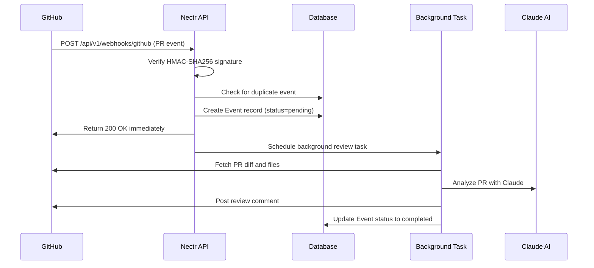

Nectr uses GitHub webhooks to receive real-time notifications when pull requests are opened or updated. This guide explains how webhooks are configured, verified, and processed.

## Overview

When you connect a repository in Nectr, the system automatically:
1. Creates a webhook on the GitHub repository
2. Generates a unique secret for signature verification
3. Configures the webhook to listen for PR events
4. Stores the webhook secret in the database

**Webhook Flow:**


---

## Automatic Webhook Installation

Webhooks are automatically installed when you connect a repository through the Nectr UI.

### Installation Process

<Steps>
  <Step title="User Connects Repository">
    User clicks "Connect" on a repository in the Nectr dashboard.
    
    Frontend calls: `POST /api/v1/repos/{owner}/{repo}/install`
  </Step>
  
  <Step title="Generate Webhook Secret">
    Backend generates a cryptographically secure random secret:
    
    ```python
    # app/integrations/github/webhook_manager.py:20
    webhook_secret = secrets.token_hex(32)  # 64-character hex string
    ```
  </Step>
  
  <Step title="Install Webhook via GitHub API">
    Backend calls GitHub API to create the webhook:
    
    ```python
    # app/integrations/github/webhook_manager.py:23-41
    payload_url = f"{backend_url}/api/v1/webhooks/github"
    
    resp = await client.post(
        f"https://api.github.com/repos/{owner}/{repo}/hooks",
        headers={
            "Authorization": f"Bearer {access_token}",
            "Accept": "application/vnd.github.v3+json",
        },
        json={
            "name": "web",
            "active": True,
            "events": ["pull_request", "issues"],
            "config": {
                "url": payload_url,
                "content_type": "json",
                "secret": webhook_secret,
                "insecure_ssl": "0",
            },
        },
    )
    ```
    
    **Events subscribed:**
    - `pull_request` - PR opened, updated, closed, etc.
    - `issues` - Issue opened, updated, closed, etc.
  </Step>
  
  <Step title="Store Webhook in Database">
    Backend saves the webhook ID and secret:
    
    ```python
    # app/api/v1/repos.py:146-156
    installation = Installation(
        user_id=current_user.id,
        repo_full_name=repo_full_name,
        webhook_id=webhook_id,
        webhook_secret=webhook_secret,  # Stored in plaintext
        is_active=True,
    )
    db.add(installation)
    await db.commit()
    ```
  </Step>
</Steps>

**Source:** `app/integrations/github/webhook_manager.py:10-48`

---

## Webhook Configuration

### Webhook Properties

| Property | Value | Description |
|----------|-------|-------------|
| **Payload URL** | `{BACKEND_URL}/api/v1/webhooks/github` | Endpoint that receives webhook events |
| **Content type** | `application/json` | JSON-encoded payload |
| **Secret** | 64-character hex string | Used for HMAC-SHA256 signature verification |
| **SSL verification** | Enabled (`insecure_ssl: 0`) | Requires valid SSL certificate in production |
| **Events** | `pull_request`, `issues` | Only these event types trigger the webhook |
| **Active** | `true` | Webhook is enabled |

### Per-Repo vs Global Secrets

Nectr uses **per-repository webhook secrets** for security:

- ✅ Each repository has a unique webhook secret
- ✅ Secrets are generated automatically on connection
- ✅ Stored in the database `installations` table
- ✅ Falls back to `GITHUB_WEBHOOK_SECRET` env var if not found

```python
# app/api/v1/webhooks.py:118-131
repo_full_name = payload.get("repository", {}).get("full_name", "")
secret = settings.GITHUB_WEBHOOK_SECRET  # global fallback

if repo_full_name:
    result = await db.execute(
        select(Installation.webhook_secret).where(
            Installation.repo_full_name == repo_full_name,
            Installation.is_active == True,
        )
    )
    db_secret = result.scalar_one_or_none()
    if db_secret:
        secret = db_secret  # per-repo secret takes priority
```

---

## Signature Verification

Nectr verifies that webhook requests actually came from GitHub using HMAC-SHA256 signature verification.

### How It Works

<Accordion title="GitHub Signs Every Webhook">
  GitHub calculates an HMAC-SHA256 signature of the webhook payload using the secret you provided:
  
  ```python
  signature = "sha256=" + hmac.new(
      webhook_secret.encode(),
      payload_body,
      hashlib.sha256,
  ).hexdigest()
  ```
  
  This signature is sent in the `X-Hub-Signature-256` header.
</Accordion>

<Accordion title="Nectr Verifies the Signature">
  ```python
  # app/api/v1/webhooks.py:24-38
  def verify_github_signature(payload_body: bytes, signature: str, secret: str) -> bool:
      if not secret:
          return True  # Skip verification if no secret configured
      
      expected = "sha256=" + hmac.new(
          secret.encode(),
          payload_body,
          hashlib.sha256,
      ).hexdigest()
      
      return hmac.compare_digest(expected, signature)
  ```
  
  **Why `hmac.compare_digest()`?** Prevents timing attacks by comparing strings in constant time.
</Accordion>

<Accordion title="Verification is Enforced in Production">
  ```python
  # app/api/v1/webhooks.py:118-135
  if settings.APP_ENV == "production":
      signature = request.headers.get("X-Hub-Signature-256", "")
      
      if not verify_github_signature(body, signature, secret):
          logger.warning(f"Invalid webhook signature for {repo_full_name}")
          raise HTTPException(status_code=403, detail="Invalid webhook signature")
  ```
  
  - **Development:** Signature verification is skipped
  - **Production:** Invalid signatures are rejected with 403
</Accordion>

<Warning>
  In production, webhooks with invalid signatures are rejected to prevent:
  - Spoofed webhook requests
  - Replay attacks
  - Unauthorized access to the webhook endpoint
</Warning>

---

## Event Processing

### 1. Webhook Receiver

The webhook endpoint receives events and returns `200 OK` immediately to avoid GitHub's 10-second timeout.

```python
# app/api/v1/webhooks.py:96-195
@router.post("/github")
async def github_webhook(
    request: Request,
    background_tasks: BackgroundTasks,
    db: AsyncSession = Depends(get_db),
):
    body = await request.body()
    signature = request.headers.get("X-Hub-Signature-256", "")
    payload = json.loads(body)
    
    # Verify signature (production only)
    if settings.APP_ENV == "production":
        # ... signature verification ...
    
    # Create event record
    event = Event(
        event_type=event_type,
        source="github",
        payload=json.dumps(payload),
        status="pending",
    )
    db.add(event)
    await db.commit()
    
    # Schedule background processing
    if is_pr:
        background_tasks.add_task(process_pr_in_background, payload, event.id)
    
    return JSONResponse(
        content={"status": "received", "event_id": event.id},
        status_code=200,
    )
```

**Key points:**
- Returns `200 OK` within milliseconds
- Actual PR review happens in background task
- GitHub's 10-second timeout is avoided

### 2. GitHub App Event Filtering

Nectr uses **per-repo webhooks**, not GitHub App webhooks. GitHub App events are rejected:

```python
# app/api/v1/webhooks.py:111-113
hook_target = request.headers.get("X-GitHub-Hook-Installation-Target-Type", "repository")
if hook_target == "integration":
    return JSONResponse(content={"status": "ignored", "reason": "GitHub App events not supported"}, status_code=200)
```

### 3. Deduplication

Nectr prevents duplicate reviews by checking for recent pending/processing events:

```python
# app/api/v1/webhooks.py:148-172
if is_pr:
    pr_number = payload["pull_request"]["number"]
    repo_name = payload.get("repository", {}).get("full_name", "")
    cutoff = datetime.utcnow() - timedelta(hours=1)
    
    # Check for duplicate events in the last hour
    result = await db.execute(
        select(Event).where(
            Event.event_type == event_type,
            Event.status.in_(["pending", "processing"]),
            Event.created_at >= cutoff,
        )
    )
    
    for candidate in result.scalars().all():
        # ... check if same PR ...
        if same_pr:
            return JSONResponse(
                content={"status": "duplicate_skipped"},
                status_code=200,
            )
```

**Deduplication scope:**
- Same PR number
- Same repository
- Within 1 hour
- Status: pending or processing

### 4. Background Processing

PR reviews happen in background tasks that can take 30-60 seconds:

```python
# app/api/v1/webhooks.py:41-93
async def process_pr_in_background(payload: dict, event_id: int):
    async with async_session() as db:
        try:
            # 1. Fetch PR diff and files from GitHub
            diff = await github_client.get_pr_diff(owner, repo, pr_number)
            files = await github_client.get_pr_files(owner, repo, pr_number)
            
            # 2. Run AI review (agentic or parallel mode)
            review_result = await pr_review_service.process_pr_review(
                payload, event, db, github_token=github_token
            )
            
            # 3. Update event status
            event.status = "completed"
            await db.commit()
            
        except Exception as e:
            event.status = "failed"
            await db.commit()
```

**Source:** `app/api/v1/webhooks.py:41-93`

---

## Event Types

Nectr processes specific pull request events:

| Event | Action | Description |
|-------|--------|-------------|
| `pull_request` | `opened` | New PR created - **triggers review** |
| `pull_request` | `synchronize` | PR updated with new commits - **triggers review** |
| `pull_request` | `reopened` | Closed PR reopened - ignored |
| `pull_request` | `closed` | PR closed/merged - ignored |
| `issues` | `*` | Issue events - logged but not processed |

**Trigger condition:**
```python
# app/api/v1/webhooks.py:145
is_pr = "pull_request" in payload and payload.get("action") in ["opened", "synchronize"]
```

Only `opened` and `synchronize` events trigger AI reviews.

---

## Webhook Management

### Viewing Webhooks

Check installed webhooks for a repository:

```bash
# Via GitHub UI
https://github.com/{owner}/{repo}/settings/hooks

# Via GitHub API
curl -H "Authorization: Bearer $GITHUB_TOKEN" \
  https://api.github.com/repos/{owner}/{repo}/hooks
```

### Disconnecting a Repository

When you disconnect a repository, Nectr automatically removes the webhook:

```python
# app/api/v1/repos.py:236-250
await uninstall_webhook(
    owner=owner,
    repo=repo,
    webhook_id=installation.webhook_id,
    access_token=access_token,
)

installation.is_active = False
await db.commit()
```

**Webhook removal:**
```python
# app/integrations/github/webhook_manager.py:50-69
async def uninstall_webhook(
    owner: str,
    repo: str,
    webhook_id: int,
    access_token: str,
) -> None:
    async with httpx.AsyncClient() as client:
        resp = await client.delete(
            f"https://api.github.com/repos/{owner}/{repo}/hooks/{webhook_id}",
            headers={
                "Authorization": f"Bearer {access_token}",
                "Accept": "application/vnd.github.v3+json",
            },
        )
        if resp.status_code == 404:
            logger.warning(f"Webhook {webhook_id} not found - already deleted?")
            return
        resp.raise_for_status()
```

---

## Testing Webhooks

### Local Development with ngrok

GitHub webhooks require a public URL. Use ngrok to expose your local server:

<Steps>
  <Step title="Install ngrok">
    ```bash
    # macOS
    brew install ngrok
    
    # Or download from https://ngrok.com/download
    ```
  </Step>
  
  <Step title="Start your local backend">
    ```bash
    uvicorn app.main:app --reload --port 8000
    ```
  </Step>
  
  <Step title="Create ngrok tunnel">
    ```bash
    ngrok http 8000
    ```
    
    ngrok will output a public URL like:
    ```
    Forwarding  https://abc123.ngrok.io -> http://localhost:8000
    ```
  </Step>
  
  <Step title="Update BACKEND_URL">
    Set your `BACKEND_URL` to the ngrok URL:
    
    ```bash
    BACKEND_URL=https://abc123.ngrok.io
    ```
    
    Restart your backend for the change to take effect.
  </Step>
  
  <Step title="Connect a test repository">
    Connect a repository through the Nectr UI. The webhook will be created with your ngrok URL.
  </Step>
</Steps>

<Warning>
  ngrok free tier URLs expire when you restart ngrok. You'll need to update `BACKEND_URL` and reconnect repositories each time.
</Warning>

### Manual Webhook Testing

Test the webhook endpoint directly:

```bash
# Test webhook receiver (skip signature in dev mode)
curl -X POST http://localhost:8000/api/v1/webhooks/github \
  -H "Content-Type: application/json" \
  -H "X-GitHub-Event: pull_request" \
  -d '{
    "action": "opened",
    "pull_request": {
      "number": 123,
      "title": "Test PR",
      "user": {"login": "testuser"},
      "head": {"sha": "abc123"}
    },
    "repository": {
      "full_name": "owner/repo"
    }
  }'
```

**Expected response:**
```json
{
  "status": "received",
  "event_id": 1,
  "event_type": "opened_pull_request"
}
```

---

## Troubleshooting

<Accordion title="Webhook Not Triggering Reviews">
  **Possible causes:**
  
  1. **Webhook not installed**
     - Check: `https://github.com/{owner}/{repo}/settings/hooks`
     - Solution: Reconnect the repository in Nectr
  
  2. **Wrong webhook URL**
     - Check: Webhook payload URL should be `{BACKEND_URL}/api/v1/webhooks/github`
     - Solution: Update `BACKEND_URL` and reconnect repository
  
  3. **Event type not supported**
     - Only `pull_request` events with actions `opened` or `synchronize` trigger reviews
     - Check GitHub webhook delivery logs for event details
  
  4. **Signature verification failing**
     - Check logs for: `Invalid webhook signature for {repo}`
     - Solution: Reconnect repository to regenerate secret
</Accordion>

<Accordion title="403 Invalid Webhook Signature">
  **Cause:** Webhook signature verification failed in production.
  
  **Solutions:**
  1. Reconnect the repository to generate a new webhook secret
  2. Check that `APP_ENV=production` is set correctly
  3. Verify the secret in database matches the webhook configuration in GitHub
  4. Check that you're not modifying the request body before verification
</Accordion>

<Accordion title="GitHub Webhook Delivery Failed">
  **Cause:** GitHub couldn't reach your webhook endpoint.
  
  **Solutions:**
  1. Check that `BACKEND_URL` is publicly accessible
  2. Verify SSL certificate is valid (required for production)
  3. Check firewall/network rules
  4. View delivery details in GitHub webhook settings: Recent Deliveries tab
</Accordion>

<Accordion title="Duplicate Reviews Posted">
  **Cause:** Deduplication logic not working or multiple webhooks installed.
  
  **Solutions:**
  1. Check for duplicate webhook configurations in GitHub settings
  2. Verify only one active `Installation` record exists for the repo
  3. Check logs for "duplicate_skipped" messages
  4. Ensure database is accessible (deduplication queries database)
</Accordion>

<Accordion title="Events Stuck in 'Processing' Status">
  **Cause:** Background task crashed or timed out.
  
  **Solutions:**
  1. Check backend logs for errors in `process_pr_in_background`
  2. Verify AI service (Anthropic) is accessible
  3. Check GitHub API rate limits
  4. Look for database connection issues
  5. Manually update event status in database if needed
</Accordion>

---

## Security Best Practices

<Accordion title="Always Use Signature Verification in Production">
  ```bash
  APP_ENV=production  # Enables signature verification
  ```
  
  Without signature verification, anyone who knows your webhook URL can trigger reviews.
</Accordion>

<Accordion title="Use HTTPS in Production">
  GitHub requires valid SSL certificates for webhooks in production.
  
  ```bash
  BACKEND_URL=https://your-backend.up.railway.app  # Not http://
  ```
  
  Platforms like Railway, Heroku, and Fly.io provide SSL certificates automatically.
</Accordion>

<Accordion title="Keep Webhook Secrets Secure">
  - Secrets are stored in plaintext in the database (they're not sensitive like OAuth tokens)
  - Each repository has a unique secret
  - Secrets are generated with `secrets.token_hex(32)` (cryptographically secure)
  - Never log or expose webhook secrets in error messages
</Accordion>

<Accordion title="Monitor Webhook Deliveries">
  Regularly check GitHub's webhook delivery logs:
  
  `https://github.com/{owner}/{repo}/settings/hooks/{webhook_id}`
  
  Look for:
  - Failed deliveries (red X)
  - Response codes other than 200
  - Timeout errors
</Accordion>

---

## Next Steps

<CardGroup cols={2}>
  <Card title="Environment Variables" icon="gear" href="/configuration/environment-variables">
    Configure webhook secrets and other settings
  </Card>
  <Card title="Feature Flags" icon="flag" href="/configuration/feature-flags">
    Enable parallel review agents and other features
  </Card>
</CardGroup>